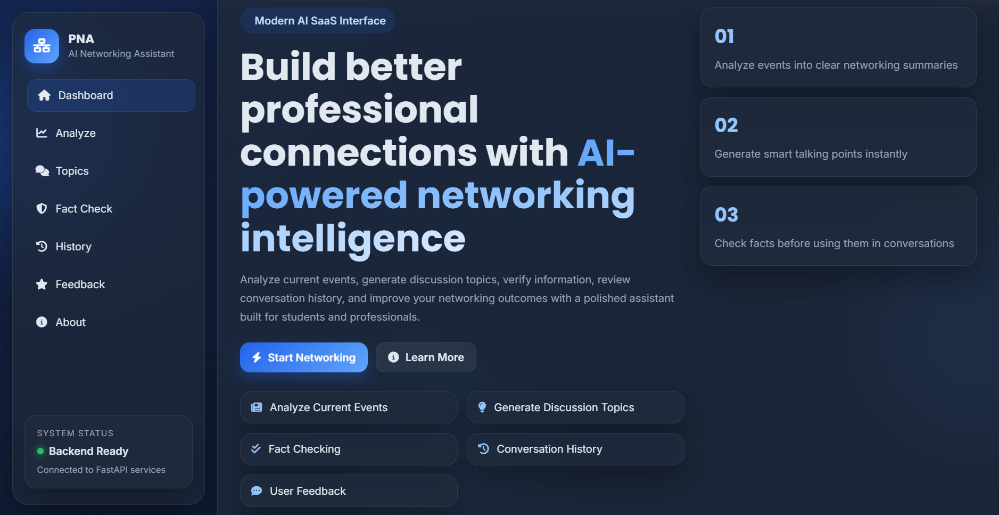
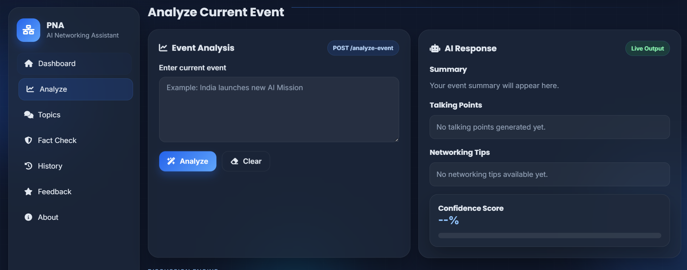
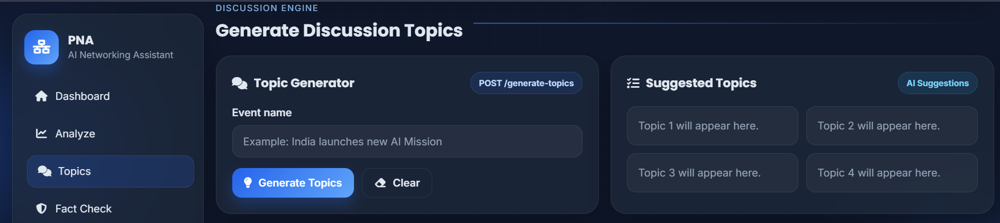
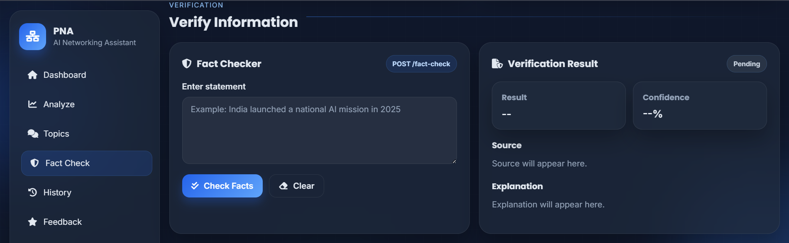
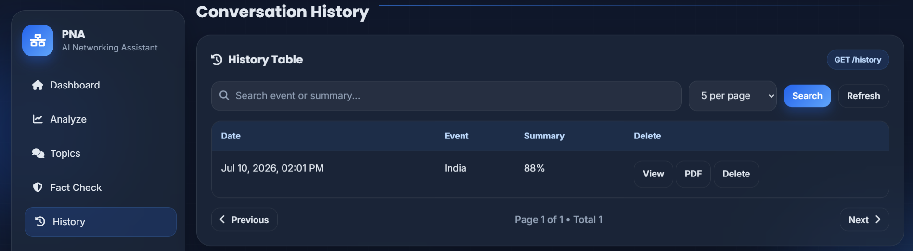
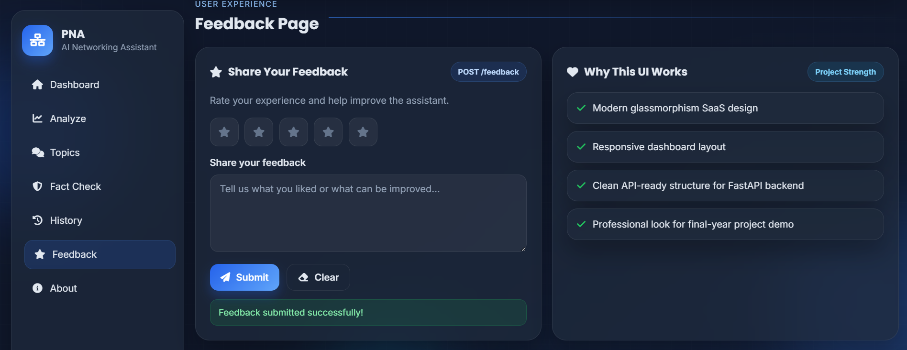
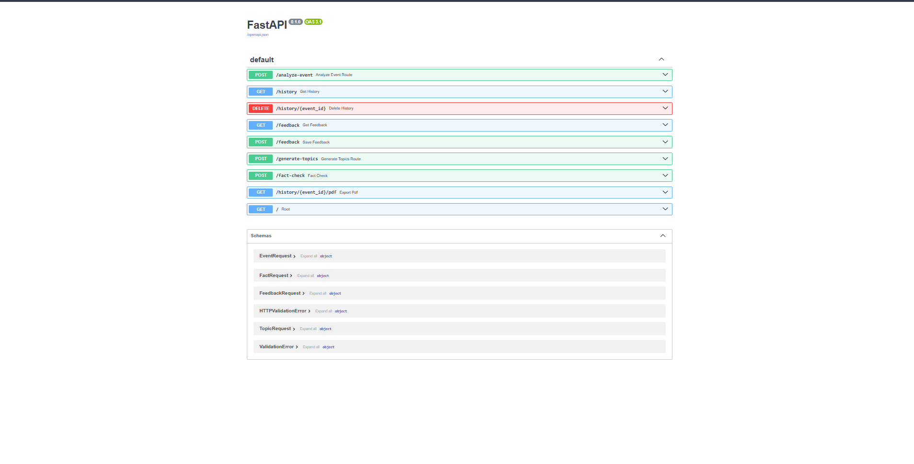

# Personalized Networking Assistant


## Project Overview

The Personalized Networking Assistant is an AI-powered web application designed to help students, professionals, and job seekers prepare for networking conversations. The application analyzes current events using Artificial Intelligence, generates relevant discussion topics, verifies factual information, maintains conversation history, generates downloadable PDF reports, and collects user feedback through an interactive web interface.

The system combines Artificial Intelligence with modern web technologies to provide meaningful networking insights, helping users confidently participate in seminars, conferences, workshops, interviews, career fairs, and other professional events.

---

## Objectives

- Analyze current events using Artificial Intelligence.
- Generate intelligent networking discussion topics.
- Verify factual information before conversations.
- Maintain conversation history for future reference.
- Generate downloadable PDF reports.
- Collect user feedback to improve the application.
- Provide a simple, responsive, and user-friendly interface.

---

## Technologies Used

### Frontend
- HTML5
- CSS3
- JavaScript
- Fetch API
- Font Awesome
- Google Fonts

### Backend
- Python
- FastAPI
- SQLAlchemy
- Pydantic
- Uvicorn

### Database
- SQLite

### Artificial Intelligence
- Google Gemini API

### Additional Libraries
- ReportLab
- python-dotenv
- Requests

---

## Project Structure

```text
Personalized-Networking-Assistant/

├── backend/
│   ├── routes/
│   ├── services/
│   ├── database.py
│   ├── models.py
│   └── main.py
│
├── frontend/
│   ├── index.html
│   ├── style.css
│   └── script.js
│
|
├── requirements.txt
├── README.md
└── .gitignore
```

---

## Modules

### Dashboard


The Dashboard serves as the home page of the Personalized Networking Assistant. It provides users with an overview of the application's features and offers easy navigation to all modules, including Event Analysis, Topic Generator, Fact Checker, Conversation History, Feedback, and About sections. The dashboard features a modern and responsive interface designed to provide a smooth user experience.



### Event Analysis
- AI-generated event summaries
- Talking points
- Networking tips
- Confidence score



### Discussion Topic Generator
- AI-generated discussion topics
- Professional conversation starters



### Fact Checker
- Information verification
- Confidence score
- Explanation and source



### Conversation History
- View history
- Search history
- Delete history
- Download history as PDF



### Feedback System
- Star rating
- User comments
- Database storage



---

## REST API Endpoints

| Method | Endpoint | Description |
|--------|----------|-------------|
| POST | `/analyze-event` | Analyze an event |
| POST | `/generate-topics` | Generate discussion topics |
| POST | `/fact-check` | Verify information |
| GET | `/history` | View conversation history |
| DELETE | `/history/{id}` | Delete history |
| GET | `/history/{id}/pdf` | Download history as PDF |
| POST | `/feedback` | Submit feedback |
| GET | `/feedback` | View feedback |



---

## Installation

1. Clone the repository.
2. Create a virtual environment.
3. Install dependencies using `pip install -r requirements.txt`.
4. Start the FastAPI server:

```bash
python -m uvicorn backend.main:app --reload
```

5. Open the frontend using Live Server or another local web server.
6. Access the API documentation at:

```
http://127.0.0.1:8000/docs
```

---

## Future Enhancements

- User authentication
- Personalized user profiles
- Cloud database integration
- Voice-assisted networking
- Multi-language support
- Mobile application
- AI chatbot integration
- Analytics dashboard

---

## Conclusion

The Personalized Networking Assistant demonstrates the integration of Artificial Intelligence, REST APIs, database management, and responsive web technologies to support users in preparing for professional networking conversations. The application offers an intuitive interface and practical features that can be extended for broader real-world use.
